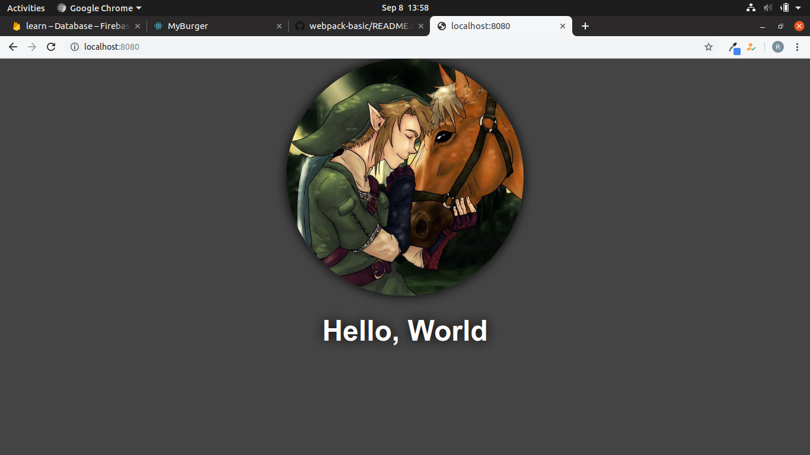

# Webpack Basic

This is an amazing project just for me, because I love webpack,

In this project I setup some loader.

## How to start over this project

install all the dependencies, run this command in the corrent directory, assuming you have installed npm.

### `npm install`

now run this command,

### `npm run start`

### Thank You all!
